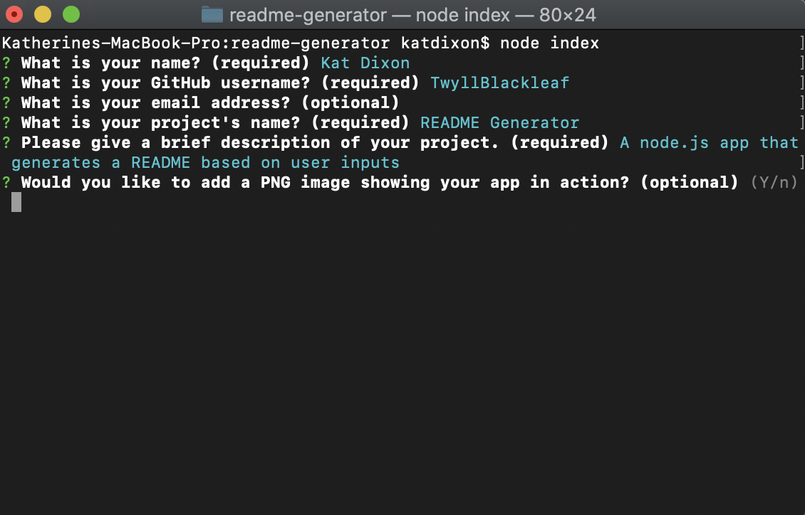
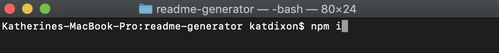

# README Generator 
        
 

- [Description](#Description) 
- [Installation](#Installation)
- [Usage](#Usage)
- [Questions](#Questions)
- [License](#License)

## Description
    
A node.js app that generates a professional README from user inputs using inquirer. 

## Installation 
        

        
Clone or download from GitHub. Make sure you have node.js and npm installed. Run “npm i” to install dependencies.

## Usage 

Run the app by using “node index” from the main folder, then just follow the prompts. The output can be found in the dist folder, and images will be in /readme-assets within that folder. You can copy the markdown file and the assets folder straight into your project, but if you want to make sure not to break the image links, please keep the file and the assets folder within the same folder.

For a video tutorial, go to this link: https://drive.google.com/file/d/1tyFwtyzpcIr0q__rB6m1u1Y1WnzX3-_Q/view

## Questions

If you have questions about the project, contact Kat Dixon.

- GitHub: https://github.com/TwyllBlackleaf  

## License

This project is licensed under [MIT License](https://choosealicense.com/licenses/mit/)
