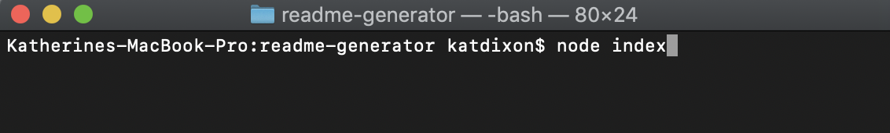

# README Generator 
        
 

- [Description](#Description) 
- [Installation](#Installation)
- [Usage](#Usage)
- [Questions](#Questions)
- [License](#License)

## Description
    
A node.js app that generates a professional README from user inputs using inquirer. 

## Installation 
        

        
Clone or download from GitHub. Make sure you have node.js and npm installed. Run “npm i” to install dependencies.

## Usage 

Run the app by using “node index” from the main folder, then just follow the prompts. The output can be found in the dist folder, and images will be in /readme-assets within that folder. You can copy the markdown file and the assets folder straight into your project, but if you want to make sure not to break the image links, please keep the file and the assets folder within the same folder.

For a video tutorial, go to this link: https://drive.google.com/file/d/1tyFwtyzpcIr0q__rB6m1u1Y1WnzX3-_Q/view

## Questions

If you have questions about the project, contact Kat Dixon.

- GitHub: https://github.com/TwyllBlackleaf  

## About Me

I'm a web developer who’s hungry for knowledge– and for opportunities to apply that knowledge as a programmer to enhance user experience; improve accessibility and security; and create stable, well-crafted, and elegantly functional code. I have a bachelor’s degree in English from Vanderbilt University and a certificate from Vanderbilt University Coding Boot Camp, a full-stack web development boot camp where I worked with JavaScript, HTML5, CSS, Node.js, Express, MySQL, Sequelize, MongoDB, and React.

With my background in English, passion for psychology, and lived experience with disability and neurodivergence, along with my love of learning for learning’s sake, I bring value to any team through supporting others, enhancing communication between team members, and quickly picking up technologies needed for the project.

In my spare time, I run games of Dungeons and Dragons, which provides a lot of experience with managing interpersonal interactions, considering and making deliberations on technical questions, and herding cats!

## License

This project is licensed under [MIT License](https://choosealicense.com/licenses/mit/)
